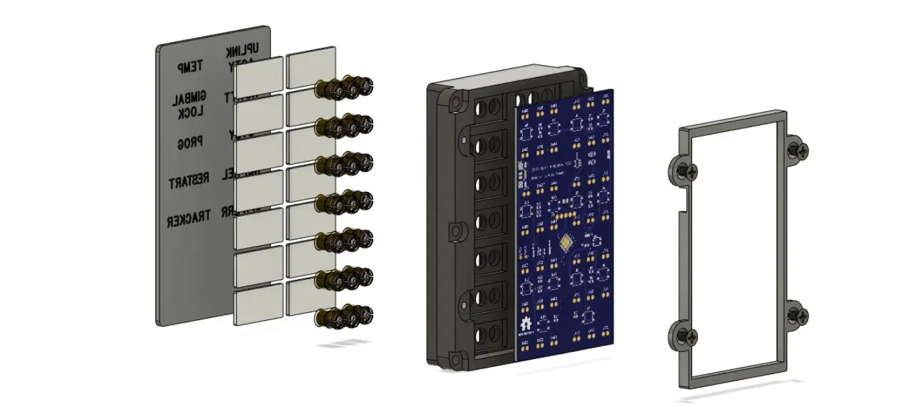

# DSKY Alarm Indicator Panel Replica

## *This project is a work in progress -- reuse at your own risk*

This is a scale functional replica of the Alarm Indicator panel for the Apollo Guidance Computer. It is
designed to be part of a larger replica of the Display and Keyboard (DSKY) module of the AGC.

This project is composed of these component subfolders:

* artwork - artwork to be silk-screened onto the front transparent acrylic cover

* pcb - KiCad project for the controller PCB design

* firmware - circuitpython board definition and python-based test and controller firmware

* hardware - 3D-printable frame components designed using Fusion 360. STEP and Fusion source files available. Hardware models used in thie replica were derived from models found in the [AGC Mechanical CAD project](https://github.com/rrainey/agc-mechanical-cad).

## Exploded View of the Assembly

[This video](https://vimeo.com/393337269) will give you a sense of the internal construction of the unit. The panel
is a combinaton of white and yellow indicators. Like the original, incendescent lamps are used for each alarm
indicator. Yellow bezel inserts supply the indictor color where needed. An AT SAMD21 microcontroller drives the lamp from a 5V DC power
source. This microcontroller includes an I2C interface designed to be the source for external control of the unit.
There's also a USB interface, however, that's more for programming than operational use.

At the top is a clear acrylic plate (0.060" thick). On that, I silkscreen lamp labels and the frame outline. Below that, there are 14 translucent covers, one for each indicator lamp array. Each indicator is composed of three incandescent lamps. Yellow bezels are inserted where needed. The bezels and the translucent covers snap into the main body of the component.  

A lamp and microcontroller PCB slides into a recess under the main body.  This PCB is held in place by a frame. The frame is secured with screws. The main body and PCB frame are both designed to be 3D printed from Nylon, ABS, or PLA.

## Painting

The original NASA drawings for all variants of this component, [1006387D for example,](https://archive.org/stream/apertureCardBox439Part2NARASW_images#page/n409/mode/1up) point to [this NASA paint specification [1008809-1]](https://archive.org/stream/apertureCardBox443NARASW_images#page/n504/mode/1up). It states [FED-STD 36231](http://federalstandard595.com/36231/) as the external color of the unit.  Good quality historial photos (examples [here](https://www.icollector.com/Apollo-CM-DSKY_i21861898) and [here](http://nassp.sourceforge.net/wiki/File:DSKY.jpg)) seem to imply a slightly different shade of gray, though. 

I haven't decided how to reconcile this difference yet. I may custom mix using Nazdar pigments, or I might simply use [an aircraft-grade epoxy premix](https://www.skygeek.com/deft-01-series-epoxy-topcoat-gray-36231-mil-prf-227750g.html) of FS36231.

## Credits and Related Projects

This project is inspired by work by Ben Krasnow creating a DSKY Electroluminescent Panel replica. You'll
find information about that project in [this Applied Science video](https://www.youtube.com/watch?v=Z2o_Sp2-aBo) by Ben. Like Ben's E/L display, this project is driven by an AT SAMD21 microcontroller chip; the same chip is used in the multiple Adafruit microcontroller boards, including the Adafruit Trinket M0.

## DSKY Alarm Indicator Replica License

Creative Commons Attribution/Share-Alike, all text above must be included in any redistribution. See license.txt for additional details.

## Adafruit Trinket M0 License

This project includes hardware design elements from the Adafruit [Trinket M0 PCB project](https://github.com/adafruit/Adafruit-Trinket-M0-PCB). Adafruit invests time and resources providing this open source design, please support Adafruit and open-source hardware by purchasing products from [Adafruit](https://www.adafruit.com)!

The Trinket M0 was designed by Limor Fried/Ladyada for Adafruit Industries.

Creative Commons Attribution/Share-Alike, all text above must be included in any redistribution. See license.txt for additional details.

## My Background

My name is Riley Rainey. I'm a software developer by profession. I spent a number of years building aerospace simulations as my day job.

## Getting Support

There's no official support available, but you can [leave comments or create an issue](https://github.com/rrainey/DSKY-alarm-panel-replica/issues) in this GitHub project.

  
This work is licensed under a [Creative Commons Attribution-ShareAlike 4.0 International License](http://creativecommons.org/licenses/by-sa/4.0/).
