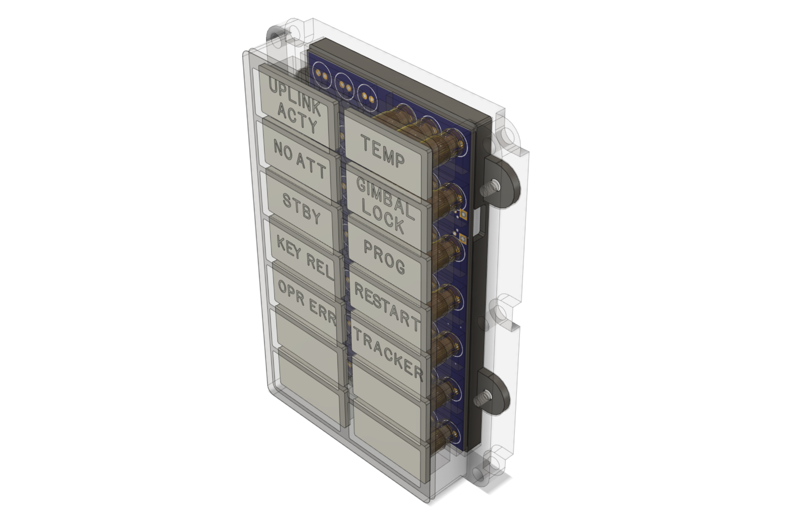

# DSKY Alarm Indicator Panel Replica

## This is a work-in-progress -- reuse at your own risk

This is a scale functional replica of the Alarm Indicator panel for the Apollo Guidance Computer. It is
designed to be part of a larger replica of the Display and Keyboard (DSKY) module of the AGC.

This project is composed of these component subfolders:

artwork - artwork to be silk-screened onto the front transparent acrylic cover

pcb - a KiCad project of the controller PCB design

hardware - an Autodesk Fusion 360-based design of 3D-printable frame components

